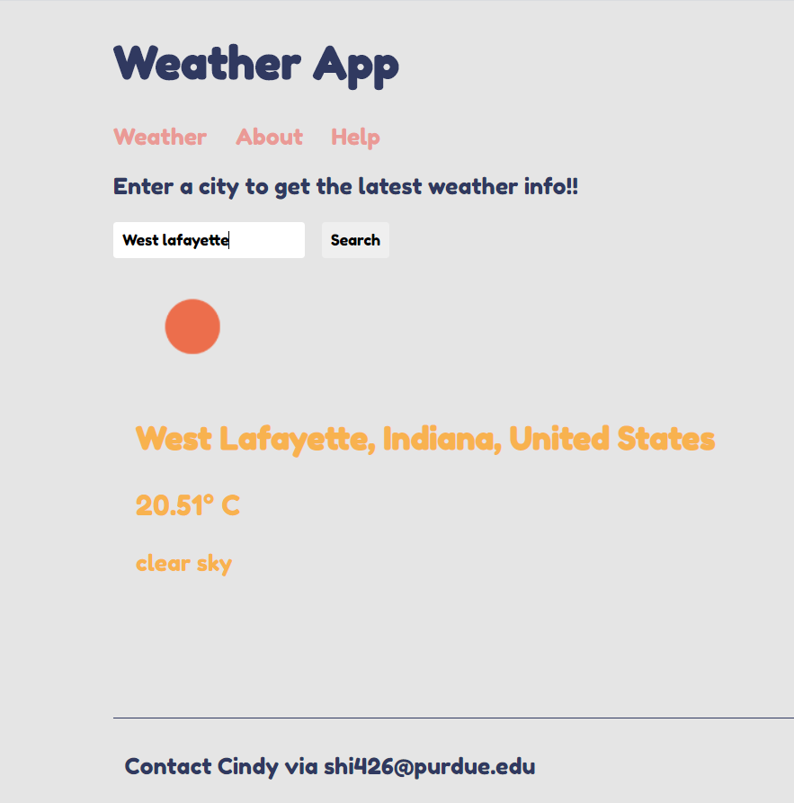

# Weather_App_2.0

  
  

    This is an improved version of the weather app I made in he past.
  

# Created with
* HTML5
* CSS
* JS (mainly Node, Express, ES6, hbs)

# Functionalities
- Provides user with its current coordinates' weather info
- Search for any location and get the weather info

# API used
* OpenWeatherMap
* MapBox

# Try the app
- Use this link <a href="https://weather-app-cindy.herokuapp.com/">View Site</a>
